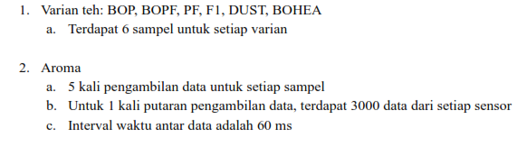
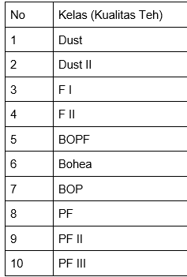

## Mengklasifikasikan Data 6 jenis teh bedasarkan sample aroma 
* varian teh : BOP , BOPF, PF,F1, DUST, BOHEA
    * Terdapat 6 sampel untuk setiap varian 

* pada setiap /dir terdapat 5 sample per varian
* di dalam /dir terdapat .csv terdapat 6 sensor yang berbeda
    * Interval waktu yang diambil sensor adalah 60ms 
    * Pada setiap pengambilan data , terdapat 3000 data

```md
- class : 6 
- 6 sample for each class 
- panjang data sekai ambil adalah 3000 dengan interval 1 detik (max_sequence length per sample)

```

<br/>



## Rumus konversi nilai analog ke nilai tegangan 
Volt value = Sensor value x (5 volt/1023)

<br>



